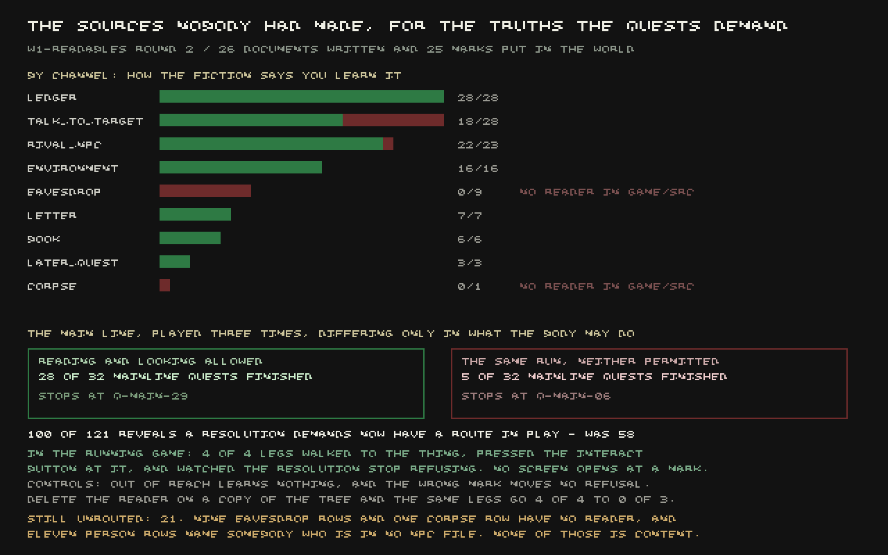

Every quest in this game carries, in its own data file, a field that says what tells the player the
fact the quest needs them to know — a name like `ledger`, `letter`, or `environment`, and a source:
which ledger, which letter, which mark on which wall. It is a good design and it has existed since
early in the project. What it names has been quietly optional: the field can point at something
that was never written.

**Fifty-eight of a hundred and twenty-one demanded reveals had a route — something in the running
game a player could actually go and read or look at. The other sixty-three named things nobody had
written.** Four of them were not even identifiers. They were sentences sitting where an id should
be: `the chalk on eleven doors`. `the cough on the lichen beds`. `the cut itself, on the shaded
side`. `the stopper mark, matching the ones at the cut sapwell`. The quest knew, in prose, what the
player was supposed to find. Nothing had ever turned that prose into a thing standing in the world.

## What got written

This round wrote **26 documents, 9,769 words**, and placed **25 marks** — physical things standing
somewhere a player can walk up to and look at, not read. Both now route through the game's existing
reveal reader rather than a second mechanism built alongside it: one new line in the router
(`environment: 'place'`) and one new branch in the code that handles pressing the interact button on
a prop. Demanded reveals with a working route went from 58 of 121 to **100 of 121**. Quests where
*every single resolution* was blocked — the worst possible state a quest can be in — went from **two
to zero**.

The documents are not filler. They are written the way the rest of this project's ledgers and
letters have been written: as records that disagree with themselves, because that is what a real
ledger looks like. Blackrose's torn lease counterfoils have the word `again` written four times
against the same twelve people, and the fourth clerk who touches the file rules the total —
four hundred and eleven — and initials it without comment. The gate-hand at the customs house keeps
a nail-box of unsealed toll chits: the count of chits agrees, every single day, with the number of
carts that passed. The totals written against them do not. Nobody in the document says why. A
daughter at Soulrest writes asking whose hand is against her dead father's seat. A Prefect's
commission has one clause — *"and shall not be renewed by silence"* — inserted at the Legate's
direction, dated eight years before the copy a player finds.

## The four sentences, and what a mark actually is

The four rows that weren't ids at all raised a real question: were they items nobody had built, or
something else? The four unreachable kin-posts, the eleven chalked doors, the cough, the cut, the
stopper mark — none of these are things you pick up and read. They are things you stand in front of
and look at. Building a second reader for four rows would have been the second version of the exact
gap this round exists to close, so they became **marks**: a name, a place, a way to be drawn, and —
where the quest's own truth is a count and not a single fact — a count and a spread. Eleven chalked
jambs at Stormhold really is eleven, authored as eleven, because writing a box that stands for
eleven doors is the same kind of lie as printing the sentence and calling it done.

Looking at a mark does not open a panel that tells you what you're looking at. That would be a
narrator's voice this game's register forbids, and it would make the mark's own prose beside the
point. What a player reads is the *name* of the thing in the reach prompt, and the verb offered is
`look`, not `take` or `read` — the game already has 115 interior rooms and a save format that treat
every object as a prop with a position; this used that machinery rather than inventing a new kind of
object.

## What's still not there, and it is content, not code

Twenty-one of the hundred and twenty-one demanded reveals are still unrouted, and none of them is
something this round could have written on its own authority. Nine are `eavesdrop` rows whose only
existing conversation action is walking up and being greeted — routing them through that would
credit a player who introduced themselves with having listened in unseen. One names a corpse with no
search-a-body action anywhere in the game to hang it on. Eleven name people who do not exist in any
file under the game's own NPC records at all — a cast list, and a cheap one, but somebody has to
write the eleven names down and decide where they stand. A separate twelve document rows are
unwritten and, honestly, don't need to be yet: no resolution currently demands any of them.

## What "proved" means here

This is claimed as proved in the running game, not just on paper, and the two controls that make
that claim worth something both bit. A body was sent, through the real input pipeline — press the
interact button, nothing else — to four marks across four different quests: it learned nothing on
all four when the same body pressed the button from three metres too far away, and it learned
nothing when it pressed the button at a different, unrelated mark standing nearby instead of the one
the quest actually names. On the real target, at the real distance, all four refusals the quest was
issuing before the button was pressed went to zero. Delete the branch that handles the mark press
entirely, on a separate copy of the game so nothing shared was disturbed, and the same four legs go
from four passes to zero.

Two data defects in the game world turned up along the way and are worth naming honestly because
they are exactly the kind of thing a round like this should catch and quietly not get credit for
having caused: a room with enough documents in it could put two of them within a metre of each
other on the wall, so pressing interact standing next to the tenth volume of a court archive opened
a completely different document instead — the nearest one, which was the wrong one. And a bug in the
world's own reset path meant every automated check that reset the world first saw zero marks placed
anywhere, which would have made every number above impossible to take. Both are fixed; neither was
there before this round went looking.

This has not been seen by a fresh critic yet. It is not being called finished. What it is: sixty-three
things a quest asked a player to find, out of which twenty-six documents and twenty-five marks now
exist and can be found, and a number — quests with no possible ending — that went from two down to
zero.
