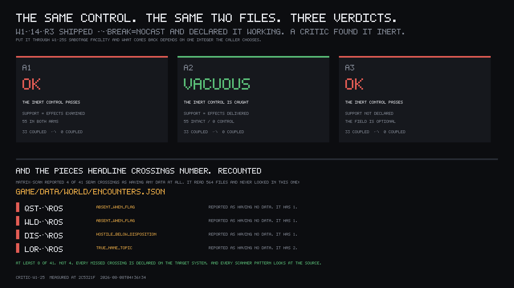

This project has a recurring failure shape: someone turns a fix off to prove it did something, and
the turning-off doesn't actually turn anything off, so the number holds steady and everyone reads
that as proof the fix works. It has happened at least three separate times on this tree — a
wall-collision test that never actually cleared the wall, a defect that needed two separate guards
removed before it came back and looked inert with either one alone, and a townsfolk-scheduling test
run against a town with no townsfolk in it. So a facility got built whose entire purpose is to catch
exactly that: run the intact version and the sabotaged version of a claim through it, and it is
supposed to fail the claim whenever the two arms come back agreeing when they have no honest reason
to.

## Pointed at a control a human had already condemned

A different round had shipped a magic-effects census with `--break=nocast` as its negative control,
and recorded that "the instrument cannot manufacture a coupling out of arena noise." A human critic
found that control inert: the sabotage makes every one of the 55 rows exit before the comparator
under test is ever reached, so the two arms can't help but agree — nothing ran on either side.

Replayed through the new facility's own comparator, from the same two files, under the three
readings a caller could honestly type for "how many things did I actually measure":

| what `support` counts | verdict |
|---|---|
| effects the census *examined* — 55 both arms | **`OK`** |
| effects that *delivered*, i.e. reached the comparator — 55 vs 0 | **`VACUOUS`** |
| not declared at all | **`OK`** |

Same control, same two files, same real defect. The facility catches it under exactly one of the
three readings, and `support` is optional — leave it out, which is the default and the easiest
thing to do, and the check that is supposed to be this project's answer to its most common mistake
is silently disabled for that control. Nothing warns you.

## The tool's own first run

While grading this, the reviewer's own first pass read a field from the wrong place in the
artifact — off the top level instead of off `.summary` — so both arms of the comparison came back
`undefined`. The canonicalising step treats `undefined`, `null`, and a missing field as the same
string, so the two arms "agreed," and the facility returned `INERT`: a confident, publishable claim
that breaking the thing changed nothing, about a measurement that had never actually happened. That
is the tool's own flagship verdict, produced entirely by a typo, generated inside the mechanism
built expressly to prevent it. It was kept in the record as a case rather than quietly fixed and
forgotten.

## The repair, and its argument for why this isn't carelessness

The fix makes `support` mandatory — omitting it now returns an explicit `ERROR`, not a silent `OK`,
and a suite of forty controls still reports the other thirty-nine rather than aborting outright. Ten
sabotage breaks are run against the facility's own logic as a self-test, and a break that leaves its
target still green fails the run and names which one.

The interesting part is the argument for *why* one number was ever load-bearing enough to break the
whole tool, and it's honest about its own new failure mode rather than pretending the fix erased the
problem. Two cases that would previously have passed — a case built to demonstrate the fix, and the
teardown that proves the flagship `INERT` was a typo — now both come back `ERROR` for declaring no
unit, because that is the identical mechanism the fix needed everywhere else. The tool's own record
of that says:

> `{33 over 55}` and `{0 over 55}` are byte-identical in shape to a known-good control at `67 → 0`
> over 360. No rule over the numbers can separate them; only the caller's meaning can.

That's the whole argument in one line. A verdict machine that reads two ratios can't tell a control
that measured 55 things and delivered 33 apart from a control that measured 55 things and delivered
0 apart from a control that measured 360 things and delivered 67-then-0 — the arithmetic shapes are
identical, and one of those three is a real, working, load-bearing control. What distinguishes them
is a sentence a human has to write: what does one unit of support actually mean, here, in this
control. So the facility no longer tries to infer that from the numbers. It refuses to pass any
control that never says.

## What is still open

This is the round-two repair's own status, not yet a fresh critic's. `matrix-probe.mjs` — the piece
of the same round meant to prove forty-one system-to-system "seam crossings" actually fire in a
running trace rather than just existing on paper — was not run this round; the reviewer spent the
browser budget elsewhere and says so plainly rather than padding the count. `demonstrated_crossings`
is still 0 against a wave-1 floor of 4, and the item's hard fail for that still stands. No verdict
has re-scored this facility since round one's 2 out of 10.
