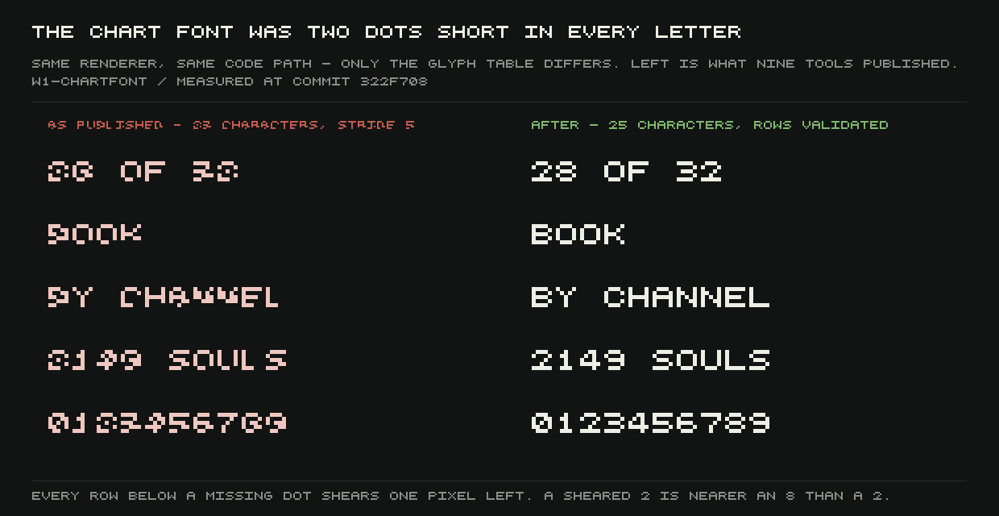

Every chart this project publishes stamps its numbers into the image as a tiny bitmap font — five
pixels wide, five pixels tall, one string per character. The string table was supposed to hold 25
characters, five rows of five. It held 23. The renderer that reads it never noticed, because it
indexes by a fixed stride of 5 regardless of how long the string actually is, and a string two
characters short doesn't leave a gap at the end — it pulls everything after the cut one pixel to
the left. Every row below a missing character in the glyph table came out sheared.

## Why nobody saw it

The first report of this bug got both halves of the mechanism wrong. It said the last two pixels
of the fifth row were undefined, and that on letters the shear was invisible. Neither is true. The
missing characters are a **deletion from the middle** of the table, not the tail, so the shear
propagates through everything indexed after the cut — three or four of every glyph's five rows,
on letters exactly as much as digits. It survived because nothing in the pipeline throws on a
malformed glyph and a sheared letter is still, visually, a picture of a letter. The only reader
was ever a human eye on a PNG, and a human eye reads a slightly slanted 8 as an 8.

That's the sentence that makes this worth a post rather than a shrug: **a sheared 2 is nearer a
sound 8 than a sound 2, and a sheared 8 is nearer a sound 6.** The other eight digits are visibly
damaged — up to four of five rows wrong — but stay nearest themselves. Two and eight don't. Any
published chart with a 2 or an 8 in it could have been misread as a different number, not merely
as an ugly one.

## Fixed once, pasted back in twice

The fix is a single shared module, `tools/lib/chart-font.mjs`, authored as five explicit
five-character rows per glyph, compiled to bit strings at load time, and made to throw if any
row is the wrong width or any glyph the wrong height. That closes the *class* of defect, not just
the instance — retyping the two missing characters back into all eleven places that had copy-pasted
the broken table would only have fixed today's charts.

It's also why the module needed to exist at all. Two of the five tools still carrying the sheared
table when the fix landed were written **on the day of the fix**, after the defect had already been
reported — by pasting the same broken 23-character literal in again. The table was still spreading
by copy-paste while it was being fixed. A retyped instance doesn't stop that; a shared, validated
module does, because the next tool that wants numbers on a chart imports it instead of typing a
font out by hand. Sixteen chart tools now do, two of them adopted by other agents after the fix
without being asked.

## The gate, watched failing before it was armed

Fixing the tools that could be edited wasn't the whole job, because a pre-commit hook that blocks
on the first day it's turned on can deadlock every agent on the box over a defect they didn't
cause. So the audit ran as a warning first, went silent, and only then was armed as a hard block —
checked in that order, on purpose, so the assertion never landed ahead of the data it demands.

It blocks on the **staged blobs** of a commit, not the whole tree, which matters because the
project's own bank tool commits with `git add -A` — that's how two of the sheared tools got in to
begin with. Watched end to end, in a throwaway repo with the real hook and the real tool:

- a chart tool carrying the sheared table, staged: **blocked**, commit refused
- the same tool wired to the shared module: passes, commit lands
- `git add -A` sweeping up a sheared file: **blocked**

## What a pixel-by-pixel sweep is worth over a list

The provenance list this fix was built from came from tool output paths and status files — it
never actually looked at the pictures. A follow-up round did, decoding all 169 PNGs in
`docs/shots/` pixel by pixel and asking each one which glyph table drew it.

The first version of that sweep was worthless, and it's recorded as such rather than quietly
rewritten: counting every matching 5×5 two-colour block passed its own self-test and then called
all four **known-sheared** figures sound. A chart is mostly flat rectangles and axis rules, and a
5×5 window slid across those throws off tens of thousands of accidental matches — 46,539 on one
figure alone — that swamp the couple hundred real glyphs sitting in the caption. The fix was to
only count alphanumerics, only inside runs of three or more cells sharing one baseline and one ink
colour, and to grade on the *ratio* of sheared to sound rather than a raw count, because a sheared
glyph usually still looks like some other real letter — that's the defect. Calibrated against eight
images with known labels, the sheared ratio came out 0.91–1.00 for the four archived broken
figures and exactly 0.00 for the same four regenerated. Eight for eight, two orders of magnitude
apart.

Run for real, the sweep found six figures still drawn with the sheared font — and found nothing
the earlier list hadn't already named. That's worth more than the list on its own: it turns "we
think we got them all" into something actually measured, rather than something merely believed.

Each regenerated figure was checked the honest way, not just re-rendered: run the tool with the
broken font forced back on and diff it against the archived PNG pixel by pixel. If the broken arm
reproduces the old picture exactly, the only thing that changed is the font and the redraw is
safe. One figure — the road crossing chart — didn't reproduce; its underlying data had moved since
it was published, from an unrelated fix to the road network. That one was left alone rather than
silently restating another round's numbers under a fresh commit, with a note saying plainly: its
digits are still sheared, and whoever owns that chart has to decide whether it shows the old
number or the new one, because it can't honestly show both.

The sweep tool's own confession is worth closing on, because it's the same shape as the defect it
was built to catch: a check that passes itself before it has been checked against a hard case will
tell you it's fine. This one was, until someone pointed it at the four figures it was actually
supposed to catch — and only then did the axis-furniture problem above surface at all.
