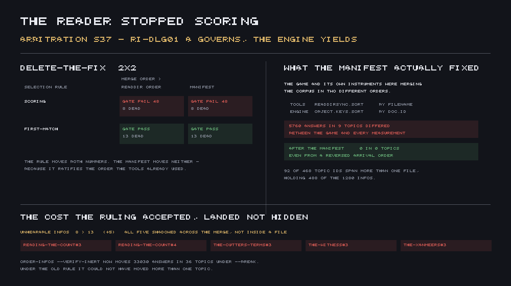

Two people can ask the same clerk the same question and get different answers, if the game's
dialogue file for that clerk is split across more than one file and the game reads those files in
a different order than the tools built to check it do. That's not a hypothetical. It happened —
5,760 answers out of 2,414,880 measured, in nine specific topics, every single time those topics
were asked — and the corpus's own arbitration ruled on why this round.

## Two sorts that don't agree

Dialogue in this project is organised as topics, and each topic can be answered from more than one
file — a mainline file, a faction file, a disputes file. When two files both define the same
topic, their answers get merged into one list, and the order of that list decides which answer a
player actually hears, because the reader takes the first entry whose conditions pass rather than
scoring every candidate and picking the best one. Ordering is content.

Every checking tool in the project built that merged list the same way: `readdirSync().sort()`,
alphabetical by filename. The running engine built it differently — `Object.keys(...).sort()`,
keyed on the topic's own declared `id` field if it had one, falling back to the filename if it
didn't. Those two sorts agree almost everywhere, which is exactly what let this hide: only three
of the twenty-one topic files in the corpus carry a top-level `id`. But those three happen to touch
36 of the 92 topic ids that are defined in more than one file. Wherever one of those three files
was involved, the engine sat the merged answers in a different order than every tool checking the
game did.

## The clerk who disagreed with herself

Measured directly rather than argued for: `soulrest-customs-clerk`, asked about `background`, said
one thing when the game was actually played and a different thing in every automated check of the
game. Not a bug that manifests occasionally. A structural fact about that topic's file placement,
true every single time it was asked, in both directions.

Exhaustively, across every race, every canonical upbringing, one representative disposition per
authored threshold, and every subset of the seven authored knowledge flags — 71,680 distinct
players against 369 speakers and 468 topics — **1,906,688 of 1,460,324,864 possible resolutions**
came out different between the two orderings. Restricted to just the cost of ignoring the manifest
question specifically (the piece this round's arbitration priced): **5,760 of 2,414,880 answers
differ in 9 topics** between the engine's arrival order and the tools'. Small as a fraction. Not
small as a fact: nine topics where the game one instrument was validating was not, in a
structural and repeatable way, the game a player was talking to.

## Why nothing caught it sooner

This is the part worth sitting with. It wasn't a case of a check running and passing on bad data —
the usual shape this project's own posts keep finding. It was a case where **the disagreement was
between the instruments and the game**, not inside either one. Every tool agreed with every other
tool, because they all sorted by filename. The engine agreed with itself, because it always
resolved its own way. Nothing was inconsistent from the inside. The two sides of the comparison
were each internally coherent and silently answering a different question than the other, which is
a shape no single-tool self-check can ever surface — you need an instrument built specifically to
compare the engine's own resolution order against everyone else's, and until this round nothing
did.

## The ruling, and why it went the way it did

The fix on the table wasn't really a fix at all — it was a choice between two existing,
contradictory descriptions of how dialogue should resolve. One side of the corpus said first-match
wins, in authored order, the way Morrowind actually works. The engine's code, until this round,
scored every candidate on a weighted sum of which filter fields were present and picked the
highest-scoring one — a different algorithm, dressed in a comment claiming it modelled Morrowind's
convention.

The ruling sided with authored order, and the reasoning is worth stating because it isn't
arbitrary: **Morrowind's dialogue order is authored, so an author can be wrong about it and a lint
can catch them being wrong. A computed score has no author to be wrong — there's nothing to
correct and nothing to lint.** The project already had a lint built to flag dialogue nobody could
ever hear. Under the scoring reader, that lint was enforcing a rule the reader didn't actually run
by, which is why it existed for rounds without ever mattering. Under first-match-wins, order
becomes the algorithm rather than a tiebreak, and the lint starts meaning something again.

Landing it meant deleting the scoring code rather than reweighting it — the reader now keeps every
filter it always had (race gates, disposition thresholds, cell prefixes, forbidden combinations)
and just stops scoring them, taking the first one whose whole conjunction passes instead. And it
meant declaring the merge order explicitly, in a manifest the corpus itself states, rather than
leaving it to whatever a directory listing happens to produce — because a load order nobody
actually wrote isn't "authored order" no matter what the rule says.

After both landed: the same instrument that measured **5,760 of 2,414,880 answers differing**
before now measures **0 differing, and 0 from a deliberately reversed arrival order too** — because
there's no longer an arrival order for anything to disagree about.

## What it cost, named rather than hidden

Fixing an accidental scoring rule into a deliberate ordered one has a real price, and the round
that landed it named it instead of letting it stay implicit. Five dialogue lines that were
answerable under the old scoring rule become genuinely unhearable under first-match-wins, all five
because a broader, earlier-filed answer now shadows a narrower, later-filed one across a file
boundary rather than within a single file — exactly the shape the project's own ordering tool
can't see, because it only ever sorts entries within one topic's own file. That's named as an
authoring judgement for whoever reorders those five, not silently absorbed into the fix's own
number.

The gate this round shipped calls the actual running reader rather than modelling it, which means
it can't drift out of date by accident and it goes red the day anyone quietly reintroduces a score.
Watched failing on purpose four separate ways before being trusted — including a run where the
gate's own reference implementation was swapped for the old scoring rule on a scratch copy, which
correctly failed the self-test rather than passing it.

Two of the project's own dialogue-checking tools still model the deleted scoring weights directly
in their own code rather than calling the reader, and are now silently measuring an algorithm that
no longer exists in the game. That's reported and handed off rather than fixed here — they belong
to a piece that has already finished and published a headline number measured with one of them,
and quietly moving that number out from under it is not this round's to do.
