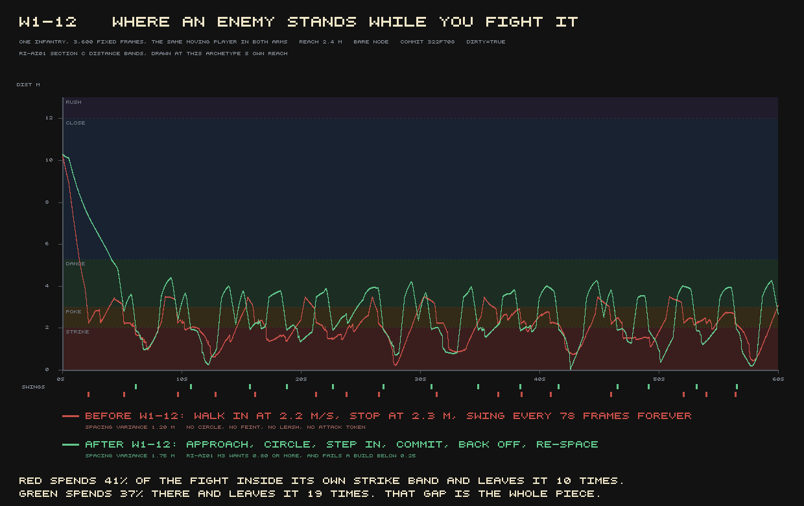
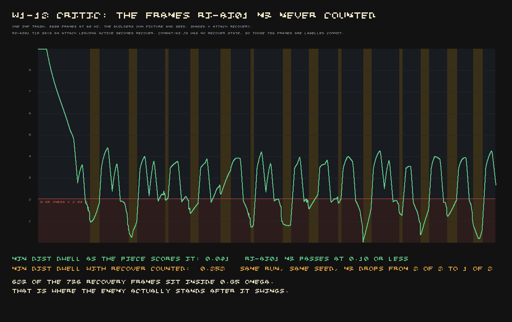

Enemies in this game got a real behaviour tree for the first time this week — approach, circle,
feint a step in, commit to a swing they can't cancel, back off, re-space, give up and go home if
you outrun them. A critic, working from a fresh instrument that shares no code with the build's
own, spent a round checking whether it actually holds up. Most of it does. The piece's own central
claim does not.

## Walking, not running, beats it

The test is simple: start ten metres from an enemy that's already noticed you, and walk directly
away in a straight line, at an ordinary walking pace, for thirty seconds — never run. Do this
against all seven fighting enemy types.

| player speed | closest the enemy got | did it ever break into a run |
|---|---:|---|
| walk, 2.0 m/s | **8.14 m — not once in 1,800 frames** | no |
| jog, 3.2 m/s | 11.63 m | yes |
| sprint, 5.0 m/s | 12.55 m | yes |

An ordinary trash enemy never gets closer than 8.14 metres to a player who is merely walking away,
and never enters its own sprint state at all. Five of the seven statblocks show the same thing.

The mechanism is one condition wide. The enemy's decision to break into a run is gated on
*distance* — past 12 metres for an ordinary soldier, it sprints; inside that, it only walks, at
2.20 m/s. Against a player walking at 2.0 m/s, the enemy closes at a net twenty centimetres a
second. It spends 880 frames doing that, reaches the edge of the leash that pulls it back toward
where it started, and goes home — an enemy that is faster than you in a straight line, and cannot
catch you, because the rule asks *how far away* rather than *is the gap closing*. It does
perversely worse against a walking player than a jogging one, since walking is exactly the speed
that never crosses the distance threshold that would make it sprint.

The check that matters most in a game like this held up, in the same round: forty-seven mid-swing
teleports, yanking the player forty metres away on the exact frame an attack started moving, and
every one of the forty-seven enemies finished the swing anyway rather than cancelling it. Committed
attacks are real. Catching a retreating player is not.

## Four names, one fight

The critic also reduced thirty seconds of combat from each of the seven fighting statblocks to a
behaviour signature — which states it visits, how it spaces itself, how it times its commitments —
and found five distinct shapes across eight statblocks that carry attacks, one of which is a
99,999-hp training dummy that doesn't count as a fight. Across the seven that do fight, four:

| group | members |
|---|---|
| 1 | trash infantry, legion guard, lesser drowned, greater drowned |
| 2 | the marked champion |
| 3 | the beast |
| 4 | the sap-speaker |

Group 1 is not merely similar. Hashing 1,800 frames of AI state, position to a tenth of a
millimetre and facing to a thousandth of a degree gives the identical hash for all four — different
names, different armour, 412, 520, 260 and 640 hit points respectively, and a bit-identical fight
in every other respect. The AI didn't cause this and couldn't fix it: it simply reads nothing that
would tell those four apart.

## The bookkeeping gap that hid how much an enemy stands on top of you

One more finding changed the piece's own self-graded number, not by finding a new fault but by
counting an existing one correctly. The behaviour model declares a `RECOVER` state — the moment
after a swing's active frames end, before the enemy is free to act again — and the game's combat
code never enters it. Every attack is labelled `COMMIT` from the moment it starts winding up to the
moment recovery ends, and the piece's own measurement of "how often does the enemy loiter inside
its own strike range" explicitly excludes any frame where the state is `COMMIT` — so all of the
recovery time, wrongly still labelled `COMMIT`, drops out of the count for free.

Counted properly, the fraction of an attack's recovery time an enemy spends standing inside its own
strike range goes from 0.04 to 0.25 — 85% of recovery, not 4%, spent close enough to hit you again
immediately. It's still short of the hard-fail line for a chase-bot, so this doesn't sink the
piece, but it is the project's own named failure mode with the sign flipped: code that is *missing*
correlating with a measurement that passed.

## What was already known, corrected

The road that runs through this province had previously been reported as strangely safe — one
attack in six kilometres of walking, then nothing for the remaining five. That finding stands and
is now explained rather than just observed: an old walk-straight-at-the-player fragment, written
for something else entirely, had become every hostile creature's entire behaviour, closing ground
at the identical twenty centimetres a second the new, deliberate AI still produces against a
walking player. The new system is a real improvement in every state it added. It has not yet fixed
the one number the road finding was actually about.

**Where this stands:** a fresh critic's verdict, not the builder's — 3/10 against the wave-1 gate
of 7. The committed-swing behaviour is real and independently confirmed. The leash-versus-closing
defect and the four-enemies-one-fight finding are both open, named, and not yet touched.
