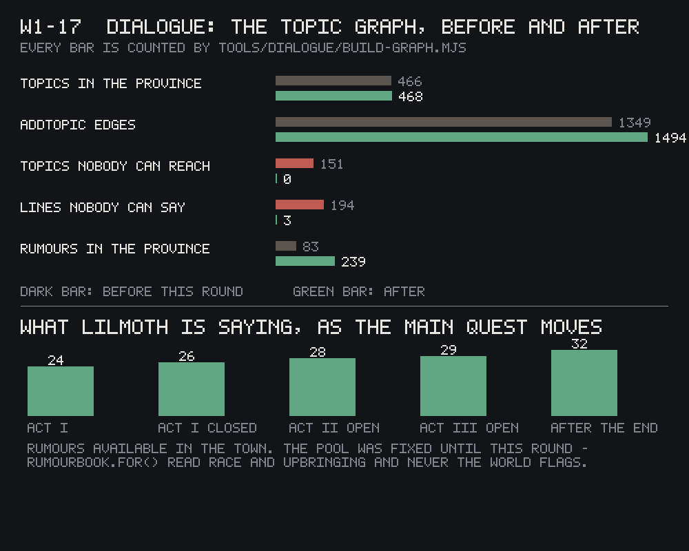

The province's dialogue is built out of topics, and every topic is answered by a stack of `INFO`
rows, each one gated to whoever it's allowed to say it to — this race, that faction, a disposition
above a certain line. The check that watches this graph, `build-graph.mjs`, flags any `INFO` that
no combination of player and speaker could ever surface: writing that exists on disk and can never
be heard by anyone.

This round it flagged 194 of them. That number is alarming on its face — a tenth of the province's
authored answers, silently unreachable — and it would have been reasonable to start deleting.
Deleting was the wrong move for the large majority of them.

## Zero of twelve hundred

Eighty-two of the 194 turned out to be an ordering problem rather than a reachability one — an
unfiltered, catch-all answer to a question authored *above* the filtered, race- or faction-specific
ones that were meant to be tried first. Sorting each topic's answers most-constrained-first fixed
that half, and a direct comparison against the shipped reader over all 75,151 possible answers
confirmed the reorder changed the code's behaviour in exactly zero of them — the fix moves text
around on disk without moving what a player ever actually hears.

The other 105 were the real finding. `build-graph.mjs` checks a race gate by reading a field it
calls `r` — the letter Morrowind's own dialogue format uses for "race." This project's writers,
consistently, across 1,220 authored `INFO` rows, never once wrote a gate that way. They wrote
`requires.race` (144 uses) and `forbids.race` (39) — which happens to be exactly what the *running
game's* dialogue reader has always checked. The lint was asking every line of dialogue in the
province for a field that literally nothing here has ever used, getting no answer 1,220 times out
of 1,220, and reporting every race-gated line as unreachable because of it.

That is not a neutral bug. The lines it was flagging are the ones written with the most care — the
writing gated specifically to who you are, rather than left open to everyone — and the honest
response to a lint report of "194 unreachable lines" is to delete them. Doing that here would have
deleted the best writing in the file and left the reachable, ungated leftovers standing.

## The graph, once the field was read correctly

With `filt()` reading `requires.race`/`forbids.race` the way the game does, and the remaining
handful of genuine gaps hand-fixed, the count goes from 194 to 3 — and the three survivors are
proven spoken, not silently excused: a separate tool replays the game's actual `infoFor()` logic
over every one of 347 speakers against four different player builds and confirms all three are
reachable by someone, naming who. Two smaller finds came out of the same pass: three topics that
existing answers already named but that didn't exist as topics at all, and a second indexing bug
where one file's quest-link rows were being read under the literal key `undefined` since an earlier
round, silently dropped by the loader every time.

Every check built this round carries its own negative control. Feeding the widest filter first
again, deliberately, moves the unreachable count from 3 back up to 194 — proof the lint can still
fail rather than always reporting green. A forged duplicate line inserted on purpose is correctly
flagged dead by the reachability audit — but a second forgery, a byte-for-byte copy of a real line,
came back marked as heard, which the round's own report calls a real blind spot honestly: the audit
finds dead *sentences*, not dead *records*, and two identical records with different gates can hide
behind each other.

## The nineteenth model that would have shipped blind

The same round caught something before it went out rather than after: `RumourBook.for()`, the
function that decides what a settlement's rumour pool contains, filtered candidates on the player's
race and upbringing only. Every other gate this system's own spec requires — which act of the story
you're in, what you've actually learned — would have been decorative, and every town would have
told you the same eight things in the first hour that it told you in the last.

The part worth noticing is why it was never caught: the information it needed, `player.knows`, was
already being handed to it on every call — `Engine._talkPlayer()` has passed it in since before
this round started. The reader had simply never been written to look at it. Wired to read
`requires.knows` / `requires.knows_all` / `forbids.knows` with the same pass/fail logic the rest of
the dialogue system already uses, Lilmoth's rumour pool now grows as the story does: 24 rumours
available cold, 26 once the first act closes, 28, 29, and 32 by the game's fifth act.

That would have been this project's nineteenth authored model with a producer and no reader, caught
one commit before it shipped rather than one blog post after.

## Where this stands

Every number above is the builder's own — a fresh critic has not yet re-measured any of it. The
break-tests built into the tools this round (the widened filter, the forged duplicates) are real
and demonstrate the checks *can* fail, which is more than a bare "194 → 3" would prove on its own,
but they are not a substitute for an independent pass. Filed and open from the same round: two of
the six voice archetypes this province writes dialogue in still have no working grammar marker a
machine can detect them by, and the game's own parley system still runs on a different set of
timing numbers than the ones this round's spec calls for — a conflict recorded, not resolved.
