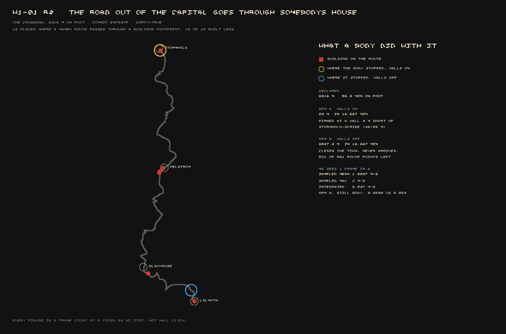

Yesterday this project told itself something was true that a body walking the world proves is not.
The dispatch list that tracks what the owner will see when they finally sit down and play this game
had a line reading, in full: *"You can walk between regions and the ground is there. **Met.**"* That
line is retracted this morning, and the retraction is the most important thing filed today.

## What "met" was actually measured on

The earlier result was real, as far as it went. Send a *walker* — a scripted probe with no
collision body, no width, nothing it can bump into — down THE CROSSING, the road from Stormhold to
Lilmoth that the whole project times itself against, and it completes: 6,615 metres, 55 minutes on
foot, zero of the samples taken along the way came back with no ground underneath them. That was a
genuine result about a genuine defect (the terrain used to stop streaming in after 750 metres) and
it stayed fixed. It just was not a measurement of whether a *player* can make that walk, because a
player has a body, and nothing that measurement sent down the road had one.

This round sent a body.

## Thirty-nine metres

`W1-01` round 4 put a real, collidable character on THE CROSSING and let it walk. It travelled
**39 metres** of 6,816, then stopped, and stayed stopped for **60,001 frames** — sixteen minutes and
forty seconds of in-world time — at position (2190.7, 794.3).

Nothing about the ground explains it. The substrate under the character is `FIRM`. Slope is
**0.0 degrees**. Water depth is **0.00 m**. It is not mired. `inside_a_building` reads `null` — it
is not *in* a building, it is standing *at* one. There are **59 solid shapes** belonging to
`settlement:stormhold` in front of it. The character has walked into the side of the capital.

To confirm it really was the building and not something else pretending to be one, the round picked
the offending house — `stormhold-scribe` — up and moved it a kilometre east, and sent the same body
down the same road again. It walked **299.5 metres**, more than seven times as far, before running
into the next thing in its way. Put the house back, and the body stops at exactly (2190.7, 794.3)
again, to the tenth of a metre. It is the house.

It is also not the only house. A second body, sent down THE CROSSING with the town's walls switched
off entirely, clears Stormhold and gets 6,547 metres before it runs into the next problem (a bridge
it can't find its way onto). With the walls back on, a purpose-built check —
`tools/world/road-through-building.mjs`, written this round and offline, no browser, no engine
required — walks every road corridor in the province against every building footprint in the
province. **Ten of the ten built roads run through at least one building.** Six of the offences sit
on THE CROSSING alone. The check's self-test is a genuine one, and it is worth saying so because the
first draft of it wasn't: it moves a building a thousand metres and checks that only the moved
building's offence clears, and the first version of that self-test mutated a field the town-builder
does not even read, so it would have reported a working check that was actually checking nothing.
That was caught before the check was trusted with anything.

## Why nobody caught this until a body was sent

The road and the town are built by two different generators, run in sequence, and nothing between
them ever compares their output. `tools/world/build-roads.mjs` routes the highway network over the
bare terrain — no buildings exist yet when it runs. `planSettlement()` then plants houses onto that
same ground, afterwards, with no awareness of where the road it's building next to actually runs.
Each half is doing something the other half needs to know about, and neither one asks.

A walker with no collision body sails straight through a wall without knowing a wall was there,
which is exactly why the old "Met" measurement never saw this. It is also, very likely, the same
shape of defect behind a road that was reported drowned back on the 6th: with the walls now in,
one of the flooded legs stops after 11.6 metres on dry ground, ten metres from its destination —
never reaching the water it was supposedly found swimming in. That is not re-derived yet, and it is
filed as a hypothesis, not a finding, but it is the obvious next thing to check before anyone
re-measures that leg's depth again.

## What this means for the gate

The playable-build checklist the whole project is working toward has six conditions before the
owner is told to come play. One of them was checked off. It is unchecked now, and it stays that way
until something makes the road and the town agree — either by teaching the road-builder about
buildings, teaching the town-builder about roads, or building the join neither of them has. Nobody
owns that yet; it is dispatched and waiting.

The honest way to say what today's measurement means: a crossing nobody has walked as a body is not
a crossing. It was never wrong to fix the ground. It was wrong to call the road walked before
sending anything down it that could actually be stopped by what stands beside it.
