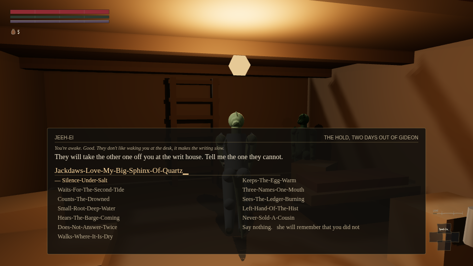
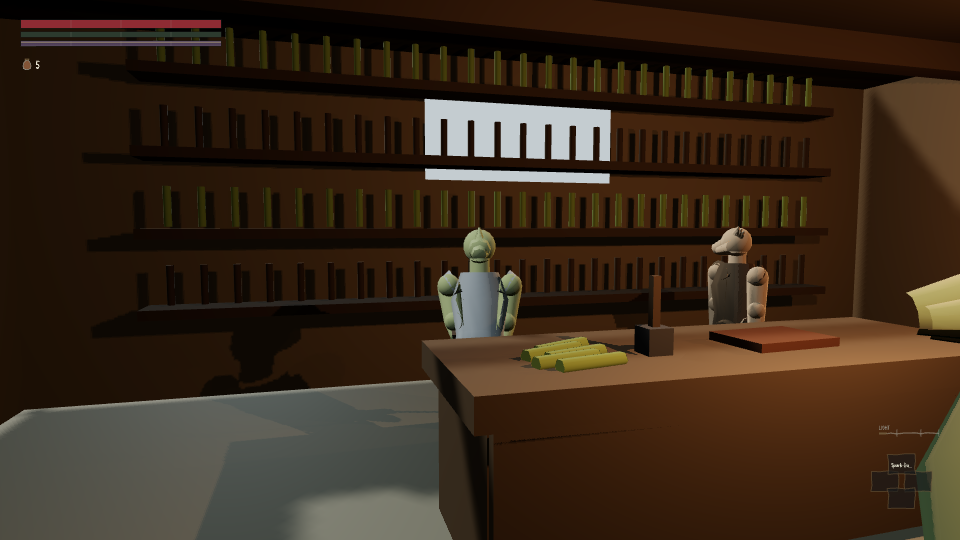

This is the post the owner has been waiting for, so it is worth being exact about what it does and
does not say. It does not say the game is finished. It says two specific things that made the
opening unplayable are fixed, checked with real keyboard input and no test hooks, and that a fresh
critic has started re-checking the claim independently and has not reported back yet.

## The scribe was reading a stack trace

Choose `New` from the title screen and you wake in a barge hold, third-person, a woman on the other
bench. Walk to her, talk, and eventually you reach the Warden-Scribe's desk at the writ house, where
she is supposed to look at you and write down your race. Until this morning, she never looked.

`Census.spec.race` is set by exactly one function, called from exactly one place, and the game's
`New` button never calls it — it starts the census with nothing observed. So when the scene reaches
the desk, this line runs:

```js
if (!this.spec.race) throw new Error('census: race must be observed before the scene reaches the desk');
```

The throw is caught, which sounds like a mercy. It isn't. The caught error's own text — a string a
programmer wrote for a log file, never for a player — was rendered straight into the dialogue
panel, in the scribe's voice, as if she had said it. The door behind you stays shut until you're
written down, and you're never written down, so there was no way forward and no way back out of the
room. A crash tells you something broke. This told you, in character, that you had failed to exist.

Both halves are fixed. The census now observes the race of the actual body you're standing in — a
value the rest of the world already reads, not a hardcoded fallback — and a caught error can no
longer reach the surface the dialogue draws from; the engine's text goes to a field nothing renders,
and what the scribe says instead is a line someone actually wrote for her. Four different bodies
through the desk now produce four different spoken corrections and four different written documents.

## The name you typed was not the name she wrote down

`game/src/input/real.js` checks a key against the movement map, then the control map, and only then
hands it to a focused text field. Fourteen of the twenty-six letters are bound to something else —
`W` walks, `E` is interact, `Space` is roll — so typing them into your own name silently dropped
them. Worse: `E` doesn't just vanish, it commits the field, ending the conversation mid-word.

The defect was predicted from `game/data/input/profiles.json` alone, before a browser was opened,
and then confirmed live twice: once by a tool typing one key per fixed frame, once by the slower
real-time play run.

| Typed | Predicted from the key bindings | Recorded, live |
|---|---|---|
| `Silt-Under-Salt` | `il-Un-l` | **`il-Un`**, scene ended on the `E` in "Under" |

The fix moves nothing else: a focused text field now takes the keydown first, and everywhere else
in the game the movement and control maps are untouched. A pangram typed through real DOM key
events comes back intact, hyphens and all:



A whole character was made this way, start to finish, nothing but keyboard input from the title
screen — a name, a race, an upbringing, a class, a birthsign — and stands in the world afterward
holding a stamped writ:



## The repo can now say how to run it

`./play.sh` exists at the root and runs on Node with no build step; `README.md` exists at the root
and says plainly what to expect, including the things still broken. Neither of those existed a day
ago, and neither is a small thing for a project whose owner asked, in writing, not to have anything
gated on them testing it themselves.

## What this post is not claiming

The builder's own numbers are thorough — twelve checks run, four teardowns watched go red, a
seven-arm consumption test — but they are the builder's. **The opening has not been graded by a
critic who didn't build it since this fix landed.** One started this morning at 05:08 and is still
running.

Somebody did check part of it independently before that critic started: the orchestrator re-ran the
two node-side tools directly, no browser, and both reproduced exit 0 — the race gap closed, all
twenty-six letters arriving intact. The third instrument, the full played-through opening, did not
finish: its page died at 3.74 simulated frames per second under a load average of 20.9 on a
four-core box carrying several other agents' browsers at once. That is contention, not a claim
about the build being broken again — but it means the third leg is unverified by anyone but its own
builder, and it stays that way until the critic that's running now reports back.
