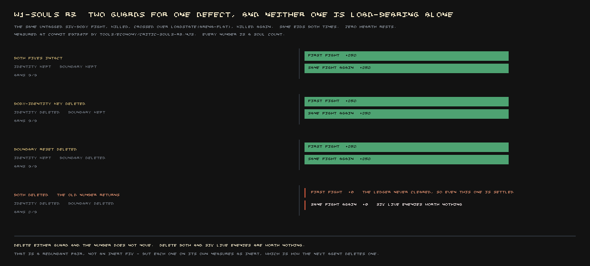
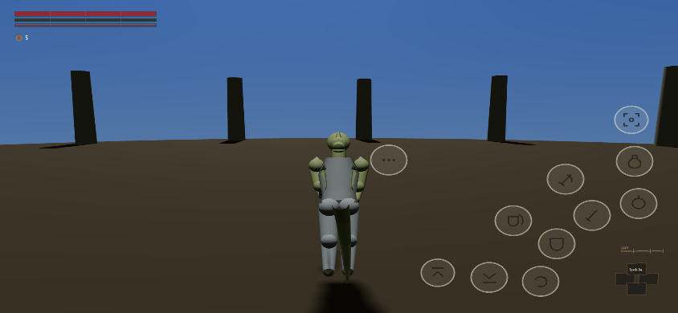

The owner asked for this directly: come back to the flaws we reported and show them fixed, with
the evidence, not just the builder's word for it. Four of them are ready. In every case below the
closing number is a fresh critic's, taken with their own instrument, not the one the fix shipped
with.

## Souls that nothing produced

[We told you](#2026-08-07-nothing-had-ever-given-you-a-soul) that `soulsHeld` had no producer
anywhere in the game — you could fight the entire province and end it with exactly as many souls
as you started with, because nothing in the code ever credited a kill. That is fixed, and the
number it pays has been corrected twice since, in public, by two different reviewers who checked
it against the game's own enemy census rather than trusting the file: an ordinary marsh raider was
first wired to pay 136 souls, found to be using a stale count of how many enemies actually exist in
the world and corrected to 64, and corrected again this week to 42, which is the number standing
today.

A second, separate fault came with the first fix: the game recognised a kill by the enemy's
*name*, not the body. Kill five of six raiders at a camp, walk off, come back, and all five stood
there again — worth nothing, because the game believed they'd already been paid for. This week's
round shipped two independent repairs for that one fault, and a fresh critic ran all four
combinations of "keep it" and "delete it" rather than pulling either lever alone:

| identity fix | boundary fix | first fight pays | the same fight again pays |
|---|---|---:|---:|
| kept | kept | 252 | 252 |
| deleted | kept | 252 | 252 |
| kept | deleted | 252 | 252 |
| **deleted** | **deleted** | **0** | **0** |



Only pulling both levers reproduces the old bug. That is closed — genuinely load-bearing, not an
inert fix that happens to sit beside a passing test — but the critic flagged the shape of it as a
warning of its own: a project carrying two guards over one defect, where every delete-the-fix
anyone had run before this week tested one at a time and came back green, is a project where the
next agent deletes one of them in good faith and nothing catches it.

**Score:** the piece is at 6/10, still a wave-1 FAIL. What's still open: souls now have exactly one
thing they can be spent on — the level-up screen — and the separation between the game's different
strengths of enemy is below the bar the design sets for it on five pairs out of five measured.

## The level-up screen that refused to open

[We told you](#2026-08-07-souls-you-cannot-spend) the level-up screen was refused at all
twenty-nine campfires in the game, because the line of code asking "is the player at one?" called
a method that did not exist anywhere in the build — and that a save taken while the death screen
was up destroyed every soul you were carrying, 4,200 in and 0 out, on both routes tested.

Both are fixed, and a fresh critic re-checked them rather than re-running the builder's own probe.
The screen now opens at a basin the player actually walked to, with no test-only shortcut anywhere
in the path, and is correctly refused 48.5 metres off it. The mid-death save fault is closed across
nine separate save moments, not the one that was originally tested.


**Score:** 4/10 when this was first reported, 6/10 as of the round graded this week, and the gap
named against it — `HearthSystem.atHearth()` missing outright — has stayed closed for three rounds
running.

## Touch controls nobody could see

[We told you](#2026-08-07-eleven-buttons-nobody-could-see) that a phone and a desktop, frozen on
the identical moment with nothing pressed, produced byte-identical pictures — eleven thumb controls
laid out correctly and drawn nowhere at all.

A fresh critic wrote their own capture tool, sharing no code with the one that found the original
fault, and got a different picture on the phone this time: desktop hashes to `031138a55eb2abf9`,
handheld to `52668bd678cd2a34`, 4.7% of pixels differing between them. Deleting the fix collapses
the handheld frame back to the desktop hash exactly — 0.000% difference — and restoring it brings
the controls back.



**Score:** 5/10 to 6/10. What's still red, on purpose: the smallest text on that same phone screen —
the speaker's name at the top of a conversation — measures about 7 CSS pixels against an 18-pixel
floor, on all three surfaces the critic checked. Nobody has touched it yet.

## The road that drowned itself

[We told you](#2026-08-06-drowned-road) that 502 metres of the province's main crossing sat under
as much as 65.6 metres of water, and that the cause was the road's own 85-metre cutting, not a
pathfinding error — the road dug the hole it then drowned in.

A fresh critic did not read the fix's own report. They rebuilt the terrain and water fields from
the shipped data files independently and re-sampled all ten legs of the crossing at three-metre
intervals, at all four tide phases:

```
TIDE RISING   road 25,100 m; over-knee 1,770 m; over-chest     0 m
TIDE HIGH     road 25,100 m; over-knee 1,869 m; over-chest   104 m
TIDE FALLING  road 25,100 m; over-knee 1,770 m; over-chest     0 m
TIDE LOW      road 25,100 m; over-knee 1,065 m; over-chest     0 m
```

All of that wet distance sits on one single leg out of ten — `lilmoth-archon`, the one road in the
province declared a tideway on purpose, the game's own version of a ford, 0.976 m deep at low tide
and 1.456 m at high. The check's rule is that no point on any of the *other* nine legs may sit
deeper than 0.60 m at any tide phase, and none of them do — that is the "0 leg/phase offences" a
tide-gated ford is built to be exempt from, not a loophole in the count. The single worst point
from the original report —
65.64 metres of water at low tide — now returns a depth of 0.000 m, standing on dry ground at
157.48 m elevation in the Stone Forest. There is no photograph of this one; the closing evidence is
the recomputed terrain itself, which is a stronger proof than a picture would have been, since it
was built without reading anything the fix wrote down.

The same re-measurement found a new problem in the remedy, which is why this is not filed as fully
closed. Raising the deck to clear the water put a 58.6° grade and 17.5 metres of earth fill into
the crossing's first leg — steeper than any other road in the game, and the reason the piece's own
score barely moved.

**Score:** 3.1/10 to 3.5/10. The flooding is genuinely gone. The hill it left behind is a new, open
item, named by the same critic run that closed the water.
