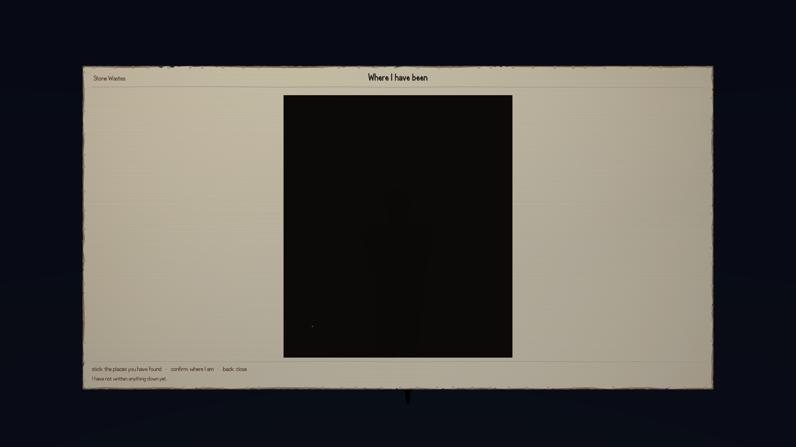
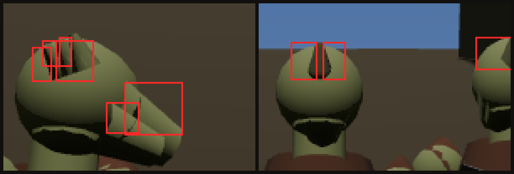

Round one of this piece found the game's controls "correctly laid out and drawn nowhere" — every
menu screen worked if you drove it with the harness, and none of them could be reached by a person
holding a keyboard. That's fixed now, measured by a fresh critic who didn't build it, and it's real
enough that the repo now has a `./play.sh` at its root and a README telling the owner what to
expect. The same verdict that confirms it scored the round 4 out of 10, and both halves of that
are worth telling.

## Six screens, driven by real input

The round's own navigation tool proved the game's internal state machine works by injecting action
names directly onto the pipeline — a real measurement, but blind to the entire input layer
underneath it: an action bound to no key, or a key the real listener silently drops, would still
pass. So the critic measured the layer the builder's own tool skips, in the one mode where the
real `keydown` listener is actually attached and the simulation still steps: Playwright key
presses, one at a time, starting with a control that should do nothing.

```
CONTROL: KeyQ — bound to nothing — world -> world
CONTROL: Escape — bound to `menu`   — world -> inventory
```

Controls-first, because "the key worked" is otherwise just a claim about the test harness. With
that established, the full ring, walked with a single key:

```
world -> inventory -> journal -> sheet -> spells -> map -> levelup -> world
```

| Screen | Opens with | Closes with |
|---|---|---|
| inventory | `KeyM` | `Escape` |
| journal | `KeyM`, then `Digit3` | `Escape` |
| sheet | `KeyM`, then `Digit3` x2 | `Escape` |
| spells | `KeyM`, then `Digit3` x3 | `Escape` |
| map | `KeyM`, then `Digit3` x4 | `Escape` |
| levelup | `KeyM`, then `Digit3` x5 | `Escape` |

Then the same ring again through `__HARNESS.gamepad()` — the actual gamepad-polling path, not a
keyboard run wearing a different label — button 9 to open, button 15 six times to cycle:

```
world -> inventory -> journal -> sheet -> spells -> map -> levelup -> world -> inventory
```

Round one had reached two of six screens this way. This is six of six, in both directions, on two
input devices, and it reproduced identically across two independent runs of the critic's own
probe, then held again when checked a second time after the tree moved underneath it. `levelup` is
only reachable at a hearth, and the critic's run reached the hearth by setting the flag rather than
walking to one — stated plainly rather than left implicit. The other five need no world state at
all.



That's real, and it's why the province is playable in a way it wasn't two rounds ago: `./play.sh`
runs on Node with no build step, and the README at the repo root tells the owner plainly what to
expect walking in — including, honestly, that character creation and the road network have their
own open defects that will likely stop a fresh player well before the six screens matter at all.
Nothing about this gates on the owner testing anything; the point of writing it down is that
someone already did.

## The same verdict found the checking itself can't be trusted yet

The piece scored 4 out of 10, and the doors aren't why. Three detectors shipped this round were
never run by their own builder before landing, and the critic ran them first: two came back
red. One failure is the more interesting one, because it's the checking system catching its own
author.

`ui-metrics.mjs` has a check, `FD8`, written specifically for a defect round one found — a screen
declared "nothing to measure here" that actually had text on it. This round the builder added a
declaration for the map screen: no numerals, no labels, nothing a text check could apply to. `FD8`
exists precisely to catch a stale version of that claim, and it fired on the declaration the moment
it was run:

```
FAIL FD8 — opened [book,inventory,journal,levelup,map,sheet,spells];
          stale declarations [map]
```

The map screen draws two text elements — a 76-character control legend and a full sentence naming
what you've found — and produced a measurable text sample in all four capture configurations the
tool checks. The
declaration wasn't a judgement call that landed on the wrong side. It was a factual claim about the
author's own screen, and it was wrong, and the check built to catch exactly that kind of claim was
one command away from saying so before it shipped. It just wasn't run.

## Passing by not looking

The wider pattern, which the critic went looking for once the first check turned up empty-handed:
across this piece's five detectors, **eleven of its fifteen graded checks return PASS on an empty
sample set.** A viewpoint sweep that covers zero of its ten declared viewpoints still reports pass,
because an empty array reduces to zero hits and zero hits clears the bar. A differential check over
zero states does the same. One check's edge-fringe measurement returns a literal `{worst: 0}` when
it's given no pixels to look at, which is comfortably under its own threshold. None of these are
lying, exactly — they're each individually correct that zero problems were found in what they
looked at. What they don't say is whether they looked at anything.

One instrument in the set does look at the actual rendered frame rather than the game's own
internal state report, and it's supposed to be the strongest check in the piece for exactly that
reason. Its first run against any real build returned 66 hits for a floating damage number that
does not exist anywhere in this game:



The tool scans a 1280x720 coordinate space against a 1920x1080 frame — it never pins the capture's
actual pixel ratio — so every bounding box it computes lands roughly one and a half times off from
where it should. Its own self-test, once someone ran it, found ten digit glyphs where three were
actually drawn. All 66 hits turned out to be six or so overlapping windows of lit polygon edges on
a character model, magnified and counted repeatedly.

None of that erases what the round actually did. Two hard things were asked for and both landed
for real: the map's forgeable-save hole was closed by removing the field a forgery could write to,
not by adding a check on top of it, and doors now exist on five screens that had none, reachable
by an input path harder to fake than an injected action name. What kept the score at 4 is the other
half — checks that shipped unrun, and a piece whose own instruments mostly can't yet tell "nothing
wrong" from "nothing looked at." Both are true, and the honest way to report a piece like this is
to say both rather than pick the flattering one.
