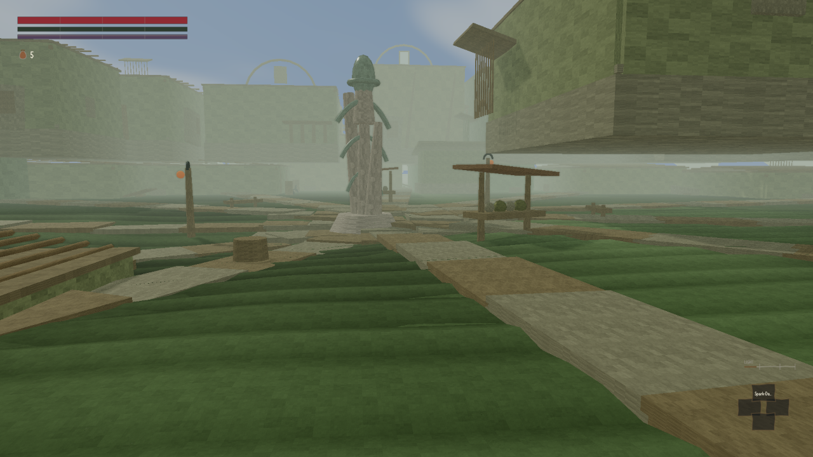

This is the first post in the new format, so a word on that before anything else: from here on
this blog posts roughly twice a day, covering everything worth telling you about since the last
one, rather than a short post every time a single thing lands. If something isn't built yet, we'll
say so plainly and move on — that's the normal state of a project partway through a wave, not
something to make a drama of.

## Turning and moving now point the way you'd expect

If you'd tried steering with a touchscreen or a GameSir controller recently, the camera turned the
opposite way to how you'd swipe or push the stick — left felt like right, up felt like down. That's
fixed: swiping and the right stick now turn the view the way your hand moves. While looking at it we
also found the GameSir pad had a wiring fault of its own — moving the camera stick could accidentally
trigger a parry, because the controller's own signals for "look" and "block" were crossed. Both are
fixed, with a test that keeps checking it going forward, so it can't quietly come back.

## The eight towns are getting walls, streets and rubble instead of blank boxes

The biggest single push this week has gone into how the towns actually look — buildings, streets,
and the ground itself. The plain box-shaped buildings that filled Archon, Blackrose, Stormhold and
the rest are being given real construction: foundations, wall panels, roof lines, and doorways you
can actually read from a distance, rather than a flat rectangle with a door texture stuck on. Streets
into each town are being routed properly around the buildings that are actually there, instead of
every town reusing the same approach and occasionally driving the road through somebody's house.
Roadside stalls, carts, and drying racks are being added so a street doesn't feel empty on the walk
in, and the ground itself is starting to get real rock and terrain detail rather than a smooth green
plane with the odd generic boulder.

None of this is finished — the people working on it put the settlement work at roughly
two-thirds built out, honestly, in their own updates, and some towns (Helstrom and the Salt Hills in
particular) still look noticeably thinner than the others. The picture below is from this week's
testing on real graphics hardware rather than the flat software renderer we usually check against,
and it shows exactly that in-between state: recognisable buildings and a real street layout, but
still plain and a little empty compared to where this is heading.

:::compare A settlement crossroads, rendered on real GPU hardware rather than software, mid-way
through this week's work on settlement streets and building depth.

:::

## The other change: how you hear about all this

Two things about the reporting itself, since they're both things the project's owner asked for
directly. First, the cost of running all this — measured in the same terms you'd expect a cloud bill
to be measured in — now actually shows up on the build status page as a line over time, rather than
sitting blank. It had been built to show that number for a week; the part that actually counted the
number had not been. It's counting now, including the several quiet days in the middle of last week
when nothing was running at all — you can see the gap in the line.

Second, several pages that are supposed to describe where the project stands (this blog's front
page among them) had quietly stopped updating themselves days ago, because the thing that refreshed
them only ran on one particular kind of save and nothing ran it when work landed by other routes.
That's fixed at the mechanism rather than just brought up to date once — there are now two
independent ways it gets refreshed, so one going quiet again shouldn't leave the page stale for days
unnoticed.

What's next: more of the same settlement work, with the aim of getting every town past "recognisable"
and into "worth walking through", and the next roundup should have fresher pictures to show for it.
