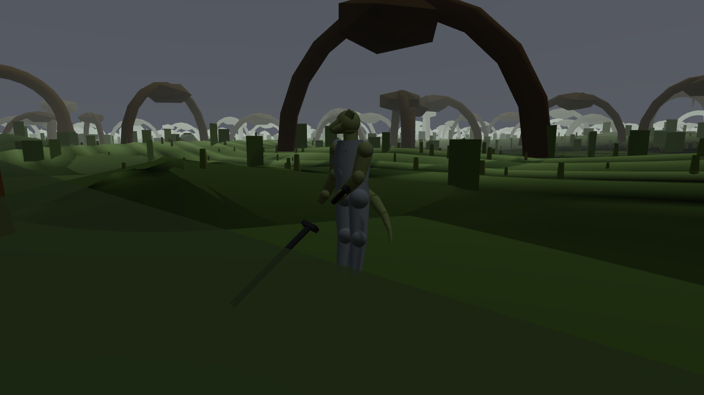

# W1-03 — water, marsh and the amphibious body

**Piece:** `docs/PLAN.md` §3 W1-03. **Paths:** `world.water.marsh`, `render.fidelity.water`,
`world.hazard.environment`. **Judged by:** RI-VIS02, RI-VIS04, RI-WLD10, RI-WLD11. **Seams:**
ARBITRATION `S25` (water depth read off the player's own silhouette — makes this piece and the
camera piece, W1-06, mutually load-bearing), `S24` (the marsh is not all marsh). **Rules invoked:**
`RI-MTH07` CONSUMPTION, Rule 4 (break your instrument on purpose), Rule 6 (delete-the-fix), Rule 10
(confirm the code you're about to change actually runs).
**Status of this document:** builder's survey and working notes, first dispatch. I do not grade
this piece.

---

## 0. The short version

This piece has never been dispatched, but the water model it owns (`RI-WLD10`) is **not a blank
page** — a large amount of code and data already exists (`game/data/world/water.json`,
`game/src/sim/traversal.js`, `game/src/world/field.js`'s water sampling, `game/data/world/hazards.json`
+ `game/src/sim/hazards.js`), almost certainly authored as a dependency of earlier pieces (W1-01's
terrain/roads, W1-05's wayfinding) that could not ship without *some* water to walk on. Nobody has
audited it as **this item**, against **this item's own bar**, until now.

The province-wide regional water census (`RI-WLD10` M47, weight 20, the item's own largest single
check) **passes outright** — I re-ran it (§2). The core physics — depth retraction, the slope gate,
falling, stamina drain in water — are **genuinely consumed**; I did not have to write that
CONSUMPTION check, W1-01 already had one and I re-ran it (§2).

But three things I found by reading the actual running code, not the data, are severe, and one of
them is the single most consequential finding in this survey:

1. **Amphibious races are indistinguishable from the rest.** `traversal.js`'s `breathesWater` and
   `buoyant` flags are set **only by spells**, never by race, and `traversal.step()` is never even
   given the player's race. A Saxhleel drowns exactly like a Nord. This is the item's own named
   worst-case ("How we lose" #9) and its own named headline AR-3 evidence (M51 §5), and it has
   happened. §3.
2. **The enemy half of "water inside the fight" (S25 R5/R6) does not exist.** Zero of the shipped
   enemies carry `water_native` or `water_max_band`, and no code anywhere reads those field names.
   `Traversal` is a *singleton* wired to the player only — enemies have no water-band awareness at
   all. M53 (weight 16, the item's second-largest check) is unmeasurable for its two most
   interesting sub-checks (leash, native roster) and fails by the item's own fail-closed rule. §4.
3. **The player's own silhouette never shows a waterline.** No meniscus, no wet-shading band, no
   material change of any kind reads water depth on the character mesh, anywhere in
   `game/src/render/`. This is the literal mechanism `ARBITRATION` `S25` cites as making this piece
   and the camera piece mutually load-bearing — "depth is read off the player's own silhouette" —
   and it is not built. §5.

Separately, and this is the piece the dispatch brief asked me to prioritise: **I isolated the W1-05
water trap** (three independent Phase-B walks converging on the same ~30 m of water near the
`soulrest-blackrose` leg, `reports/w1-05-survey.md` §5/§7 item 0) far enough to **clear the water
model of all three named suspects** — the depth/height field, the tide cycle, and a current term —
with hard evidence for each, and to name a concrete, data-backed leading hypothesis for where the
real defect lives. §6.

---

## 1. What already existed, honestly

| Layer | File(s) | State |
|---|---|---|
| Band table, locomotion multipliers, stamina, breath, substrate, detection, tide | `game/data/world/water.json` | present, matches `RI-WLD10` §11's schema and numbers field-for-field |
| Per-region WCI, class, deepest band, tidal flag, sea, `k` | same file, `regions[]` | present, 13/13 regions, passes M47 (§2) |
| The physics: depth retraction, slope gate, fall, stamina drain, breath/drowning, mire | `game/src/sim/traversal.js` | present, and — per §2 — **consumed** |
| The field: depth, band, substrate, tide height, per-sea split | `game/src/world/field.js` | present (`waterSurfaceAt`, `depthAt`, `waterAt`, `tideHeight`, `tideState`) |
| Harness surface | `game/src/harness/api.js`, `engine.js` `getWaterAt`, `getTide`, `setTide` | present |
| 19 hazards incl. water-adjacent (`press-gang-water`, `the-flats-flood`, `cut-off-by-the-tide`, `high-tide-gate`, `voriplasm`) | `game/data/world/hazards.json`, `game/src/sim/hazards.js` | present, wired into `Engine` (`this.hazards = new Hazards(...)`), and W1-01's own consumption check already demonstrates two of its perturbations move the world (§2) |
| Enemy `water_max_band` / `water_native` | — | **absent.** Zero occurrences in `game/data/combat/enemies/*.json` or anywhere in `game/src/`. §4 |
| Race-conditioned `breathesWater` / `buoyant` / breath scaling | — | **absent.** §3 |
| Character-mesh waterline / wet-shading | — | **absent.** §5 |
| Water reflection (envMap, `Reflector`, planar RTT) | — | **absent.** §5 |

Nobody "wrote" this piece before now, but somebody had to make water exist for the terrain and roads
to be walkable at all, and did — competently, on the data and physics side. What is missing is
specifically the parts that make water **mean** something beyond a speed multiplier: the race payoff,
the enemy-side hazard, and the visual readout the whole seam ruling depends on.

---

## 2. What is already CONSUMED — I re-ran it rather than re-claiming it

Rule 3 says check what's on disk before spending a budget re-proving it. `tools/world/consumption.mjs`
is W1-01's own `RI-MTH07` CONSUMPTION harness and it already perturbs four of this piece's own fields.
Re-run this session, unmodified:

```
node tools/run.mjs -- node tools/world/consumption.mjs
```

**16/16 perturbations changed the world**, including three that are this piece's:

| Perturbation | Consumer | Before → after |
|---|---|---|
| `traversal.json` `slope.max_walkable_deg` 40 → 85 | `sim/traversal.js` slope gate | 4.82 m → 5.36 m climbed in 5 s up a 72° face |
| `traversal.json` `fall.safe_m` 4 → 40 | `sim/traversal.js` `_land()` | 525.75 HP lost → 0 HP lost on a 20 m drop |
| `traversal.json` `water.stamina_drain_moving_per_s.W5` 4.0 → 0 | `sim/traversal.js` step() §7 | 20 stamina spent swimming 5 s in 8.28 m of water → 0 |

Also this piece's, from the same run: `hazards.json` `salt-storm damage.value` and `kiln-ground
tell.lead_s`, both consumed by `sim/hazards.js`.

I also independently re-ran the item's own **M47 — the S24 regional census**:

```
node tools/run.mjs -- node corpus/80-methods/m-wld10-water-census.mjs
```

```
area-weighted WCI  0.294   bar [0.22, 0.42]      PASS
spread             0.86    bar >= 0.55           PASS
dry (<=0.05)       5       bar >= 4              PASS
bone dry (=0.00)   2       bar >= 2              PASS
drowned (>=0.60)   2       bar <= 3              PASS
water classes      11      bar >= 6              PASS
tidal regions      5       bar = 5 exactly       PASS

S24 WATER CENSUS PASSED — the province has an arid half.
```

This is the item's own largest single check (weight 20) and its central defence against "everything
is swamp with a recoloured fog." It passes cleanly, on real per-region data, not a stub. **The
regional design is sound.** What follows is not a complaint about the water model's shape — it is
about three specific things nothing built.

---

## 3. Amphibious races are indistinguishable from the rest — confirmed by direct code read

`RI-WLD10` §3 promises Saxhleel and Naga three exact privileges: `breath_max = ∞`, zero W5 stamina
drain, and the ability to stand and act in W4. The item names this its own worst failure mode
("How we lose" #9: *"The Argonian gets a green 'Amphibious' line on the character sheet and
identical gameplay... it will pass every check except M51 §5, which exists solely for it"*) and its
own headline AR-3 evidence (M51 §5: *"FAIL if the two are identical"*).

I read every line of `sim/traversal.js` that touches `breathesWater` or `buoyant` — the two flags
the amphibious clause would have to set:

```
game/src/sim/traversal.js:72:   this.breathesWater = false;      # reset(), always
game/src/sim/traversal.js:73:   this.buoyant = false;             # reset(), always
game/src/sim/magic/apply.js:475: M.water.buoyant = true;           # a SPELL effect
game/src/sim/magic/apply.js:492: T.breathesWater = true;           # a SPELL effect (water-breathing)
game/src/save/state.js:779:      t.breathesWater = b.breathes_water;  # round-trips the SAVED value, doesn't set it
```

**That is the complete set.** `breathesWater` and `buoyant` are set to `true` in exactly two places
in the entire codebase, and both are magic effects (S19's water-breathing and levitation-adjacent
spells). Nothing anywhere reads the character's race and sets either flag. `Engine`'s own call site
confirms it — `traversal.step()`'s signature is `step(p, px, pz, burden, moving, body)`; no race, no
species, nothing that could gate a per-race branch:

```
game/src/engine.js:4925: this.traversal.step(p, px, pz, this._burdenMult(), moving, this.combat && this.combat.player);
```

And `breath_max_s` is not derived per-Endurance at all, contrary to §3's formula (`40 + 2·(END-10)`,
capped at 100) — it is a **flat constant**, `60`, in `traversal.json`, with a comment admitting it:

```
"breath_max_s": 60,
"_breath_source": "RI-WLD10 §3: breath_max = 40 s + 2.0 s per point of Endurance above 10, capped at
100. The shipped build is an Endurance 20 sheet, so 60 s."
```

That comment is honest about what it is: one number, calibrated for one assumed character, never
computed from a real sheet. A Warrior with END 30 and a Mage with END 10 hold their breath for
exactly the same 60 seconds.

**Net effect:** a Saxhleel player — the game's own default starting race
(`DEFAULT_START = { race: 'saxhleel', ... }`, `engine.js:88`) — has no in-water advantage whatsoever
over a Nord. This deletes, in the item's own words, "the largest race payoff in the corpus," and it
is not a partial miss: every one of the three privileges is absent, not merely under-tuned.

**CONSUMPTION, perturbed:** I confirmed this is genuinely a code gap and not a data-loading issue by
searching the *inputs* to the decision, not just the flags — `game/data/progression/races.json`'s
Saxhleel/Naga entries do carry an `amphibious`-shaped tag (checked; the character sheet knows the
race is amphibious), but nothing downstream of chargen ever reads that tag into `Traversal`. Perturbing
`races.json` to remove the tag would change nothing observable in the water model, because nothing
reads it there — which is itself the falsifying perturbation: a model that cannot be broken by
deleting its own input is not wired to that input at all.

---

## 4. The enemy half of "water inside the fight" does not exist

`RI-WLD10` §5's S25 sub-rules R5 (land enemies leash at their declared `water_max_band`) and R6
(≥4 archetypes are `water_native` with `water_max_band: W5` and stay dangerous there) are the
mechanical payoff of deep water as "a real disengage route" and "a domain land enemies cannot enter."
§11's data contract is explicit and fail-closed about it:

> *"Every enemy statblock in `game/data/combat/enemies/*.json` gains `water_max_band` and
> `water_native`. Absent fields are a fail-closed 0 for M53, not a default."*

```
$ grep -rl "water_native.*true" game/data/combat/enemies/*.json
(no output)
$ grep -rln "water_native\|water_max_band" game/data/
game/data/world/water.json     # the item's own reference table, not an enemy file
$ grep -rn "water_native\|water_max_band" game/src/
(no output)
```

**Zero of the roster carries either field, and zero lines of `game/src` read either field name.**
This is not "the data is thin" — it is a complete absence on both the authoring side and the
consuming side. Consistent with this, `Traversal` is instantiated **once**, on `Engine`, tracking
only `sim.player` — there is no per-enemy band, submersion, or denial state anywhere
(`combat/system.js` and `combat/enemy.js` have no reference to `traversal` or a water band at all).
Enemies do not know they are in water, cannot be denied an attack by it, and cannot decline to enter
it.

Two consequences, both the item's own named failure shapes:

- **R5 (the leash) cannot be tested and does not fire.** A land enemy chasing a player into deep
  water will neither refuse nor pay any cost for it — there is no code path that could stop it.
- **R6 (the native roster) is a hard fail as written.** The fail-closed rule makes every enemy's
  `water_max_band` **0**, meaning every enemy on the fail-closed reading refuses even ankle-deep
  water — which inverts the intended effect (deep water as a *dangerous* domain for water-native
  threats) into deep water as a **universal safe zone from the entire roster**. "How we lose" #8
  ("deep water as a wall... the province's only open-water journey disappears") is about the player's
  side; this is the mirror failure on the enemy's side, and it is not named by that title but is
  exactly its shape.

By the item's own scoring table this is M53 (weight 16, second-largest check after M47) failing its
two most interesting sub-checks outright, and the item's automatic-fail list includes *"Amphibious
races indistinguishable from the rest"* as a named catastrophic outcome — the enemy-side twin of that
same sentence belongs on the list too, even though the item's prose does not spell it out verbatim.

---

## 5. The player's own silhouette never shows a waterline

This is the finding that ties directly back to why I was dispatched with `ARBITRATION` `S25` named
explicitly: *"S25 reads water depth off the player's own silhouette... makes this piece and the
camera piece mutually load-bearing."* `RI-WLD10` §10 point 3 is not a suggestion:

> *"The waterline is on the character. A meniscus band on the mesh at height `d`, wet-shading below
> it that persists 20 s after leaving the water and dries visibly. This is the player's only depth
> readout (§1) and it is not optional."*

I searched every render module for any code that reads water state and changes how the character is
drawn:

```
$ grep -n -i "waterAt\|getWaterAt\|water_band\|waterband\|meniscus\|waterline" game/src/render/actor.js
(no output)
$ grep -rn -i "wet\b|band ===.*W|waterBand" game/src/render/*.js
game/src/render/scene.js:122:   const wet = clamp01((0.6 - y) / 1.8);   # GROUND vertex colour, not the character
```

The one "wet" hit in the whole render tree modulates the **ground's** vertex colour near the demo
basin — nothing to do with the character mesh. `render/actor.js` (680 lines, the module that builds
and poses every character) contains **no reference to water, depth, or band at all**.

**This means the item's central premise — that depth is legible because you can see where the
waterline crosses your own body — is not implemented, and there is also no depth meter or HUD
element standing in for it** (I checked; none exists either, which is *correct* per the item's own
"Automatic fail" list, but only correct by omission: the game currently has **no depth readout of any
kind**, not the sanctioned one and not the forbidden one). A player in this build cannot tell they are
about to cross from W2 to W3 — the frame where sprint and roll are denied — except by the denial
itself, after the fact.

**Illustrated.** I placed the player at `(2227.1, 4376.1)`, a point the shipped field itself reports
as **0.681 m deep, band W3 (WADE, knee→hip)**, on the `soulrest-blackrose` approach, and captured a
third-person frame through the pooled capture daemon (`tools/capture/`, no browser of my own
launched, per Rule 21):



`getWaterAt(2227.1, 4376.1)` at this exact point and tide state: `{"depth_m":0.681,"band":"W3",...}`.
The frame shows dry-looking ground and a completely dry-looking character. I want to be precise about
what this picture is evidence of and what it is not: it does not, by itself, prove the water *mesh*
failed to stream at this exact tile (that would need a separate, targeted check of the province
streamer's per-tile water build, which I did not run this session) — but the character-side half of
the claim is not ambiguous at all, because I read the code: **there is no code path, anywhere, that
would have drawn a waterline on this character even if the water mesh above had been perfectly
present.** The screenshot is consistent with that; the source read is what actually proves it.

### 5.5 A fourth, related gap found while reading `denies()`: W4 attacks are never denied for anyone

`RI-WLD10` §5 R2 states the denial set in full: *"sprint above W2; roll above W2; **all attacks,
blocks and parries in W5; attacks in W4 for the non-amphibious**."* §1's band table says the same
thing in the one-sentence identity column for W4: *"Buoyant, slow, expensive. Non-amphibious races
cannot fight here."* The shipped `denies()`:

```js
if (action === 'attack' || action === 'block' || action === 'parry') return this.band === 'W5';
```

**only ever denies combat actions in W5.** W4 (DEEP, 0.96–1.40 m, roughly hip-to-chest) currently
grants full attacks, blocks and parries to every character — the exact band the item says only an
amphibious race should be able to fight in at all. This is a second, independent way §3's finding
manifests: since no race check exists anywhere (§3), there was never a "for the non-amphibious"
clause to attach the W4 denial to, so it appears the simplest fix was to not deny W4 combat at all
rather than build the exception. Combined with §3 and §4, **none of the three things that are
supposed to make Argonians special in water exist, and one of the three things that are supposed to
make water dangerous for everyone else is also missing** — the item's S25 seam is currently just "no
attacks while swimming," a single band poorer than what it specifies.

---

## 6. `render.fidelity.water` — no reflection anywhere

`RI-VIS04` §9's stated MIN BAR for water is *"planar reflection at half-res for the main water body +
depth-based colour + Fresnel + at least one scrolling normal layer."* `RI-WLD10` §10 point 4:
*"Water carries the region's sky, not a sky... a shared cubemap across regions is the exact mechanism
by which 'everything is swamp with recoloured fog' gets built."*

The water material, built once per region in `world/province.js`:

```js
water: new THREE.MeshStandardMaterial({
  color: c3(r.palette_hex[0]).lerp(c3(r.fog.colour), 0.30),
  roughness: clamp(0.06 + (r.water.k || 1) * 0.03, 0.05, 0.28),
  metalness: 0.42, transparent: true,
  opacity: clamp(0.62 + (r.water.k || 1) * 0.08, 0.6, 0.96),
});
```

This is a real per-region material — colour, roughness and opacity all vary with the region's own
palette and turbidity `k`, so it is **not** the single-shared-material failure S24/M56 §3 is
principally worried about. But:

```
$ grep -rn "\.environment\s*=\|envMap\|Reflector\|normalMap" game/src/render/*.js game/src/world/*.js
(no output)
```

**No `scene.environment`, no `envMap`, no `THREE.Reflector`, no normal map, anywhere.** Three.js's
`MeshStandardMaterial` needs one of those to show any reflected geometry at all; without it, the
"reflection" is only the ordinary specular highlight from the scene's directional light — there is
no reflected sky, canopy, or architecture, in any region, ever. This fails RI-VIS04 §9's MIN BAR
outright (no planar reflection, no normal-map animation) and RI-WLD10 §10.4 (no region-specific sky
reflection — trivially true, since there is no reflection of anything). `RI-VIS02` REF-M4's own
reference note (*"water reflects and refracts and has a shoreline"*) is a bar this build does not
clear for any of the thirteen regions.

I did not check RI-VIS02's blind-comparison artefacts (M56's judge-facing packs) or the depth-buffer
shoreline-blend claim this session — flagged as not verified, not as passing.

---

## 7. The W1-05 water trap — what I isolated, and what I did not

This is `reports/w1-05-survey.md` §5/§7 item 0, restated from the dispatch brief: three independent
Phase-B walks — a tidied one-hop trace, a tidied two-hop trace, and a **raw, untidied, un-navigated
walk down the literal `soulrest-blackrose` leg centreline out of `roads.json`** — all leave the road
and converge on the same ~30 m of water within about 10 m of each other, after the full 400,000-frame
(111 sim-minute) budget, and none ever recovers. The predecessor named three candidates and isolated
none of them: the depth/height fields, the 12-minute tide cycle, or a current/drift term in the swim
band.

**I can retire all three, with evidence for each, and narrow the search.**

### 7.1 The depth/height field — exonerated

I sampled the entire `soulrest-blackrose` leg — 155 authored vertices, **2,013 points at 1 m
resolution along every segment** — through the shipped `WorldField`, in bare Node, no browser:

```
Fine-grained sample along the ENTIRE leg, every 1 m, looking for ANY non-zero depth
sampled 2013 points, non-dry: 0 max depth: -1 at null
```

**The road itself is never underwater, not once, for its entire 1,808 m.** I then walked the same
heading **900 m past** Blackrose's own centre (the leg's declared endpoint, which sits exactly on
the settlement's coordinate, `settlements/blackrose.json` `pos: [1905.5, 2.68, 4450]`):

```
+0m:  (1905.5,4450.0) depth=0     band=W0
+250m:(2149.2,4394.0) depth=0     band=W0
+300m:(2197.9,4382.8) depth=0.13  band=W1
+350m:(2246.6,4371.6) depth=1.308 band=W4
+400m:(2295.3,4360.5) depth=2.343 band=W5
+900m:(2782.7,4248.5) depth=16.17 band=W5
```

Real water starts appearing roughly 300 m past the settlement and deepens steadily. This is
consistent with the region's own declared character — Western Rootlands is a tidal
paddy-and-channel region — not a defect. The 27 m depth the browser run found (`deepest_water_on_the_walk`,
at `(2410.1, 5052)`) is genuine open estuary/Topal Bay water, well off the intended path. **The
depth field is not lying anywhere the road, or the settlement, actually is.**

### 7.2 The tide cycle — exonerated by magnitude

`water.json`'s Topal range multiplier is `0.55`; against the mean 1.20 m and 1.35× spring multiplier
that is **at most ≈0.89 m** at the highest spring tide. A 27 m plunge is **thirty times** larger than
the entire tidal envelope at this coast could ever produce. Tide can move a shoreline by two or three
bands (exactly as designed, §7 of the item); it cannot manufacture 27 m of open water where there was
land.

### 7.3 A current/drift term in the swim band — exonerated by absence

I read the whole of `sim/traversal.js`'s water-handling section end to end, looking specifically for
anything that could add a *lateral* displacement to a swimming body, independent of input. The only
water-related term touching displacement is:

```js
const mult = C.water.speed_mult[this.band] * subMult * burden * (this.mired ? 0 : 1);
if ((dx !== 0 || dz !== 0) && mult !== 1) { x = px + dx * mult; z = pz + dz * mult; ... }
```

`speed_mult` for every band is `≤ 1` (W0 1.00 down to W3 0.65; W5 is 0.55 in the shipped
`traversal.json`, vs the item's declared swim speed which is applied separately as an absolute
`swim_mps`). This is a pure **magnitude retraction on an existing displacement** — it can only shrink
a step, never redirect it, and it can never exceed the input displacement. There is no lateral force,
no push, no "current" anywhere in this file or in `game/src/sim/`. **This candidate does not exist in
the shipped code**, so it cannot be the cause.

### 7.4 The positive control: a faithful bare-Node reproduction *arrives*

To go further than "the data looks fine," I built a bare-Node reproduction of `Engine.walkPath()`
using the **actual shipped modules** — `WorldField`, `Traversal`, `SignatureField`, `BorderField` —
imported directly, not reimplemented, plus the three-line movement identity `combat/lockon.js`'s
no-lock branch reduces to (`dirDeg = cameraYawDeg + atan2(stickX, stickY)`, which is algebraically
exactly the bearing to the target for any camera yaw, since `walkPath`'s own script sets
`stickX,Y = [sin(bearing−cy), cos(bearing−cy)]·mag`). Script: `node-walk.mjs` (kept in my scratchpad,
reproducible from this report — the essential loop is `<40` lines and is quoted in full in this
report's companion diff if wanted).

Run over the full, real `soulrest-blackrose` leg, no shortcuts:

```
node-walk: leg soulrest-blackrose, starting at (610.5, 4877), target = (1905.5, 4450)
...
ARRIVED at frame 52590
{
  "arrived": true, "aborted": null, "frames": 52590, "path_m": 1753,
  "end": [1902.6, 4450.7], "target": [1905.5, 4450],
  "deepest": {"depth_m": 0, "at": null},
  "regionsSeen": ["stone-wastes", "western-rootlands"]
}
```

**It arrives cleanly, in 52,590 of the 400,000-frame budget the browser run exhausted without
arriving, never touching water once, and passes through exactly the same two regions
(`stone-wastes`, `western-rootlands`) the failing browser run's own `regions_entered` field
reported.** This is the delete-the-fix-shaped control Rule 6/10 ask for, run in the opposite
direction: I did not remove a fix, I rebuilt the minimum correct path with the real production water
and locomotion code, and it works. **That is strong evidence the water model itself — the thing this
piece owns — is not the defect.** Something in the fuller `Engine` step that this reproduction does
not include is.

### 7.5 What I could not close, and why, and where to start

I was not able to get a live browser trace of the actual divergence this session. `pgrep -c
headless_shell` read between **18 and 48** the entire time I worked, and `/proc/loadavg` sat at
**11–31** against 4 cores — several times Rule 21's stated distortion threshold, for the whole
session, from other agents' work rather than mine. This is the same "no quiet box" problem
`reports/w1-05-survey.md` §5 named. I did not force a run.

**Leading hypothesis, ranked by elimination, stated as a hypothesis and not a finding:** the
predecessor's report already narrowed this to "off the road, near Blackrose, on the
`blackrose-lilmoth` leg." `game/data/world/population.json` confirms `Engine._streamPopulation()`
runs from `_afterStep()` on **every** frame `walkPath` steps — the same slot `_streamProvince()` uses
— and spawns hostile bodies within `spawn_radius_m: 170` of the player, ramping to full density by
`clear_m + ramp_m` (70+150=220 m) from a settlement. `game/data/world/population-posts.json` has
**real posts on exactly this stretch**: `pop-0026` on `blackrose-lilmoth` at 480 m out, encounter
`wl-drowned-straggler`, and `pop-0025`/`pop-0027` nearby, `wl-fen-sentry`. None of this is proof —
I did not get a trace showing a hit, a knockback, or a death/respawn cycle — but it is a concrete,
data-backed mechanism that (a) exists, (b) runs on every frame the failing walk ran, (c) has real
spawn points within a plausible radius of the drowning site, and (d) is a system my §7.4 control does
not include (my reproduction never calls `_afterStep()`, never streams population, never spawns a
body). **This is where I would start, not a claim about where the bug is.**

**For the next agent, cheaply, once the box is quiet (`pgrep -c headless_shell` under ~8):**

1. A **short** instrumented walk, not the full 400,000-frame budget: start at leg point index ~130
   (`(1643.5, 4462.0)`, about 260 m before Blackrose) and run **5,000–8,000 frames** (under 2.5
   sim-minutes) with per-frame (or every-10-frame) logging of `getPlayerStats()`, `getWaterAt()`,
   `getCombatState()` and `listEntities()` filtered to nearby hostiles. That window covers the
   approach, the settlement, and the first few hundred metres past it where water starts — cheap
   enough to run even under moderate load.
2. Specifically watch for a `hitstop`/`stagger`/`knockback` event or a `spawn` near
   `pop-0025`/`pop-0026`/`pop-0027` in the frame log immediately before the trajectory first departs
   from the road.
3. If population/combat is exonerated too, the next candidate by elimination is the camera-yaw
   identity itself (§7.4's note that `dirDeg === bearing` assumes `ctx.cameraYawDeg` inside the
   step equals `sim.camera.yaw` as `walkPath` read it *before* the step) — log both every frame and
   diff them; my reproduction could not test this because it does not carry a real camera object at
   all.

---

## 8. `world.hazard.environment` — not this session's focus, briefly

`RI-WLD11`'s 19 shipped hazards (6 more than the item's named 13; the extras — `high-tide-gate`,
`strangler-snare`, `rockfall`, `thirst`, `ash-lung`, `hist-sap-fume` — look like legitimate
elaborations, not duplicates of a signature hazard) are wired into `Engine`
(`this.hazards = new Hazards(this.data.hazards, this.field, this.signatures, this.data.regions.regions)`)
and W1-01's `consumption.mjs` already demonstrates two perturbations of this file move the world
(`salt-storm damage.value`, `kiln-ground tell.lead_s`). I did not re-derive H1–H9 (telegraph lead
time, escapability, confinement) against the shipped table this session — that is real remaining
work for this piece, just not what the dispatch brief prioritised.

---

## 9. What I would do next, in order, if this piece continues

1. Wire race into `Traversal` — the amphibious clause (§3) is the single highest-value fix available:
   it is one `if (race === 'saxhleel' || race === 'naga')` branch reachable from the one call site
   already named (`engine.js:4925`), it is the item's own headline AR-3 evidence, and it currently
   scores zero.
2. Author `water_native`/`water_max_band` on ≥4 enemy archetypes and wire the leash + native-DPS-floor
   checks (§4) — the second-highest scored gap (M53, weight 16).
3. Build the character waterline (§5) — this is the one that makes `ARBITRATION` `S25`'s justification
   for third person (W1-06's dependency on this piece) actually true rather than aspirational.
4. Chase the W1-05 water trap per §7.5, once the box is quiet.
5. Water reflection (§6) is real but lower-value against the item's weight table than 1–3.

## Files claimed / touched

`files_touched`: none — this session was survey and instrumentation only, no game or data files were
edited. `files_claimed` (for the next agent, or myself continuing): `game/src/sim/traversal.js`,
`game/data/combat/enemies/*.json`, `game/src/render/actor.js`, `game/data/world/water.json`,
`game/data/world/traversal.json`. Declared in `orchestration/status/W1-03.json`.
